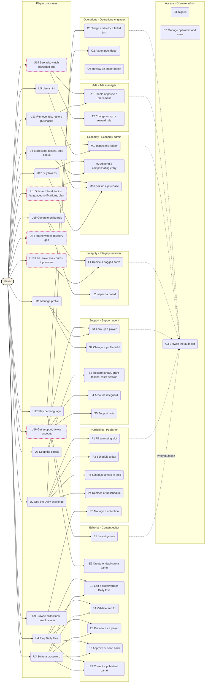

# Crosscut — player use cases and the admin capabilities that cover them

**TL;DR:** 17 player use cases taken from the player app design are covered by 26 admin use cases across eight operator roles; five player needs have no admin coverage yet and are listed as gaps.
**Confidence:** High for the player side (read directly from the player prototype and handoff) and for editorial, publishing, support and operations; medium for economy, ads and access, whose backend commands do not exist yet.
**Peter decides:** whether the five gaps become admin use cases now or stay out of the first clickable prototype.

## Vocabulary

Crosscut has two games, named as the player app names them. The generic noun is **game**, never "puzzle".

| Term | Meaning |
|---|---|
| Crossword | The grid game. A Mini is 5 × 5 with par 5:00; a weekend grid is 9 × 9. |
| Daily Five | The five-letter deduction game, "One word. Six tries." Wordle-style, but that word never appears in the product. |
| Daily challenge | The daily pair: exactly one crossword and one Daily Five per language per day. The player app shows it as "Today's drop" at the top of the feed. |
| Drop | The moment a Daily challenge is published, at a UTC or player-local time. |
| Collection | A themed, sized, setter or archive shelf in Browse, with a lock rule and a reward. |
| Tokens 🪙 | Earned from time left against par and from rewards; spent on hints. Can be bought. |
| Stars ⭐ | Earned only by solving. Never bought or spent. |
| Streak 🔥 | Consecutive days with at least one game solved. Counts across languages. |

## Player use cases

Read from the player prototype (`user-app/Crosscut Prototype.dc.html`) and its handoff. The player is one actor; use cases are grouped by the loop they belong to.

| ID | Player use case | Where in the player app |
|---|---|---|
| U1 | Onboard: pick level, topics and language; answer the notification prompt; pick a plan (Lite with ads, month, year) | Welcome, Quiz, Plan ready, Notifications, Paywall |
| U2 | Open the feed and see the Daily challenge (shown as Today's drop) with each game's Start / Continue / Review state | Feed |
| U3 | Solve a crossword against par with autocheck and the timer | Play |
| U4 | Play Daily Five in six tries | Daily Five |
| U5 | Use a hint: 50/50, reveal a letter, solve the word; go to Wallet when tokens run out | Hint sheet |
| U6 | Earn stars, tokens and the time bonus, and see the celebration | Solved |
| U7 | Keep the streak: streak-at-risk card, streak strip, reminders | Feed, Solved, Notifications |
| U8 | Spin the fortune wheel or reveal the mystery grid | Feed cards |
| U9 | Browse collections and archives, continue an unfinished game, unlock a collection and claim its reward | Browse, Collection detail |
| U10 | Like and save posts; see live solved and solving-now counts and today's top solvers | Feed action bar, Game page |
| U11 | Manage the profile: language, completed games, achievements | You |
| U12 | Buy a token pack and understand tokens versus stars | Wallet |
| U13 | Remove ads with a paid plan; restore purchases | Paywall, You |
| U14 | See ads on the Lite plan: interstitials between posts, rewarded ads for tokens or a hint | Feed, Hint sheet (rewarded surface not yet drawn) |
| U15 | Compete: top solvers today on a game page, the weekly board in the backend | Game page (no full board screen yet) |
| U16 | Get support: lost streak, wrong charge, duplicate account, delete the account | Not in the player app yet; backend has `deleteMe` |
| U17 | Play in English, Ukrainian or Russian, with games written per language | Quiz, You |

## Admin actors

The backend design names only "editors" and a shared admin token. The console needs finer roles because the safeguards differ by domain. One person may hold several roles; the console shows only the navigation a role permits.

| Actor | Owns | Never does |
|---|---|---|
| Content editor | Library, crossword and Daily Five editors, validation, preview, approval | Scheduling, player data |
| Publisher | Daily challenge desk, the two daily slots, publish time, schedule-ahead, collections | Editing game content |
| Support agent | Player lookup, profile fields, streak, session and token support actions, account safeguards, notes | Leaderboard or ledger decisions |
| Integrity reviewer | Flagged solves, board eligibility decisions, shadow status | Reward decisions, which stay with economy |
| Economy admin | Ledger inspection, compensating entries, purchase lookup | Editing balances directly |
| Ads manager | Placement enablement, caps, rewards, first-session grace, fill and grant health | Campaigns, targeting, revenue reporting (AdMob) |
| Operations engineer | Job signals, retries, pool depth, import batch outcomes | Content or player mutations |
| Console admin | Operator accounts and roles (through Better Auth), environment, audit log | Domain work |

## The one diagram: player use cases and the admin capabilities that cover them

Left: the player and what they do. Right: the admin use cases, grouped by area, and the operator role behind each group. A solid edge from a player use case to an admin use case means "this admin capability is what makes the player use case possible or repairable". Player use cases with no edge to the right are the gaps listed after the diagram.

### Coverage matrix

| Player use case | Covered by | Coverage |
|---|---|---|
| U1 Onboard | M3 for the chosen plan | Partial. Notification prompts and level or topic defaults have no admin control. |
| U2 See the Daily challenge | P1–P4 fill and schedule the Daily challenge; O1 retries a failed generation | Full |
| U3 Solve a crossword | E3–E7 create, validate, preview, approve and correct the crossword | Full |
| U4 Play Daily Five | E3–E7, with Daily Five validation: answer length, dictionary membership, invalid characters, answer reuse | Full |
| U5 Use a hint | M1 shows hint spend in the ledger | Full for inspection. Hint prices are not editable in the console by design. |
| U6 Earn rewards | M1 inspects, M2 compensates a missed credit | Full |
| U7 Keep the streak | S3 restores a lost streak | Partial. Streak reminders are push notifications, deferred past v1. |
| U8 Wheel and mystery grid | None | Gap |
| U9 Browse collections | P5 membership, order, lock rule, reward, visibility | Full |
| U10 Like, save, counts, top solvers | L1 keeps a cheated solve off "Top solvers today" | Partial. Likes, saves and live counts have no moderation and need none in v1. |
| U11 Manage profile | S1 finds the player; S2 changes a field with a reason | Full |
| U12 Buy tokens | M3 finds the purchase; M2 credits a verified but uncredited pack | Full for support. Pack prices stay in the stores. |
| U13 Remove ads | M3 verifies the plan; A1 confirms which placements a plan suppresses | Full for support |
| U14 See ads | A1 and A2 own placements, caps, rewards and first-session grace | Full for app-owned rules. The rewarded surface is not yet drawn in the player app. |
| U15 Compete | L1 decides flagged solves; L2 inspects the board | Full for the backend board. The player app has no full board screen yet. |
| U16 Get support | S1, S4 and S5 | Full once a contact path exists in the player app. |
| U17 Play per language | E1 and E2 create games per language; O2 watches pool depth per language and kind | Full |

### Gaps with no admin coverage

1. **U8 Wheel prizes and mystery-grid picks.** Prize table (50 / 10 / 0 / 25 / 5 / 15 tokens), spin frequency and the mystery pick rule are product constants with no operator control. Candidate: an Economy rules card, reason-gated like ad rules.
2. **U1 and U7 Notifications.** Streak warnings, daily-drop pings and rival-overtake notices are shown in onboarding but push delivery is deferred past v1. Candidate: a Notifications area under the engagement scope already listed as "later" in the research brief.
3. **U14 Rewarded surface.** The console owns rewarded placement rules, but the player app has no rewarded-ad moment drawn. The player design must add it before A2 changes anything a player can feel.
4. **U15 Player-facing board.** The backend materialises a weekly board and the console can inspect it; the player app only shows "Top solvers today". Player design decision, not a console gap.
5. **U16 Support contact.** No in-app path to reach support, restore purchases beyond the paywall footnote, or request deletion. The console flows exist; the request channel does not.

## Admin happy paths

Each path is the single unbroken route from intent to confirmed result. Error branches are out of scope for the clickable prototype except where a failure is the normal first state (E4, P1). "Reason" always means a required free-text field; "Review" always means a before/after panel with a confirm control.

### Editorial (Content editor)

| ID | Happy path | Screens and dialogs |
|---|---|---|
| E1 Import games | Library (Crosswords or Daily Five tab) → Import → pick JSON files → validation summary (accepted / rejected counts) → per-item results → Import → games appear in Library as Draft and in Operations as an import batch | Library, Import dialog (3 steps), Operations |
| E2 Create or duplicate a game | Library → active tab sets the kind → New game (language, difficulty) or row menu → Duplicate as draft → editor opens on the new Draft | Library, New-game dialog, Editor |
| E3 Edit a crossword or Daily Five | Editor → Metadata tab (title, language, difficulty, topics, author) → Content tab (crossword: grid, clues, answers; Daily Five: five answers, hint, dictionary check) → Save → version incremented | Editor (Metadata, Content) |
| E4 Validate and fix | Editor → Run validation → Validation panel lists failures with the exact cell or clue → click a failure to focus it in Content → fix → re-run → Passed | Editor (Validation panel) |
| E5 Preview as a player | Editor → Preview → phone-frame rendering of the feed card and the play screen → close | Editor (Preview) |
| E6 Approve or send back | Editor (Needs review, validation Passed) → Approve (reason optional) or Send back (reason required) → status updates; the game becomes available to P1 | Editor (Review bar), Library |
| E7 Correct a published game | Library → Published row → Create correction → editor on a new version → validate → Approve → Publish correction → players who already solved keep their result, new players get the corrected version | Library, Editor, Publish-correction review |

### Publishing (Publisher)

| ID | Happy path | Screens and dialogs |
|---|---|---|
| P1 Fill a missing slot | Daily challenge → blocked day → Choose a crossword or Choose a Daily Five → picker filtered to Approved of that kind and language → pick → day becomes Ready | Daily challenge desk, Day inspector, Picker |
| P2 Schedule a day | Day inspector (Ready) → publish time (UTC or player-local, representative local times shown) → Confirm schedule → Review (items, time, consequence) → Confirm → status Scheduled, audit entry | Day inspector, Publish-time panel, Schedule review |
| P3 Schedule ahead in bulk | Daily challenge → List → tick ready dates or Select all ready → Schedule N Daily challenges → Review shows count and effective time → Confirm → per-date results (queued, or skipped with reason) | Daily challenge list, Bulk review, Bulk results |
| P4 Replace or unschedule | Day inspector (Scheduled, not yet live) → Replace a slot → picker → or Unschedule → reason → day returns to Ready | Day inspector, Picker, Reason dialog |
| P5 Manage a collection | Collections → Collections tab → pick a collection → membership (add from library, reorder, remove) → metadata (shelf, emoji, blurb, unlock rule, reward) → visibility → Preview shelf → Save | Collections list, Collection editor, Preview |

### Support (Support agent)

| ID | Happy path | Screens and dialogs |
|---|---|---|
| S1 Look up a player | Players → list of every player, filtered live by ID, name or sign-in → open → Profile, Timeline, Devices & ads, Notes tabs | Players list, Player record |
| S2 Change a profile field | Player record → Profile → Edit a field → change → Save → Reason → Review (old, new, notification to player) → Confirm → audit entry, field marked Changed | Player record, Reason and review dialog |
| S3 Restore streak, grant tokens, reset session | Player record → Support actions → choose action → parameters → Reason → Review (before/after, ledger effect) → Confirm → timeline and audit updated | Player record, Action panel, Review dialog |
| S4 Account safeguard | Player record → Account → Force sign-out, Suspend, Merge duplicate, or Delete on request → Reason → two-step confirm for destructive ones → result state | Player record, Safeguard dialogs |
| S5 Support note | Player record → Notes → Add note → text and status Open / Closed → Save; close an open note | Player record (Notes) |

### Integrity (Integrity reviewer)

| ID | Happy path | Screens and dialogs |
|---|---|---|
| L1 Decide a flagged solve | Collections → Leaderboards tab → flagged row → Evidence (solve time vs cohort, S1–S4 flags, device change, prior decisions) → Clear, Exclude from board, or Shadow → Reason → Confirm → decision shown, board eligibility updated, audit entry | Leaderboards queue, Flag detail, Decision dialog |
| L2 Inspect a board | Collections → Leaderboards tab → Boards → scope (week or game, language) → ranked list with eligibility markers → open a player → jumps to S1 | Leaderboards boards, Player record |

### Economy (Economy admin)

| ID | Happy path | Screens and dialogs |
|---|---|---|
| M1 Inspect the ledger | Economy → filter by player, entry type, date → entry detail (reason, operator or system, idempotency key, balance after) | Economy ledger, Entry detail |
| M2 Append a compensating entry | Economy → player → Add compensating entry → amount and currency → Reason → Review (current balance, entry, balance after) → Confirm → entry appended, audit entry. Disabled with an explanation until the audited server command exists | Economy ledger, Compensation dialog |
| M3 Look up a purchase | Economy → Purchases → search by player or receipt → purchase detail (pack, plan, idempotency key, status) | Economy purchases, Purchase detail |

### Ads (Ads manager)

| ID | Happy path | Screens and dialogs |
|---|---|---|
| A1 Enable or pause a placement | Ads → placement toggle → effective time (now or scheduled) → Reason → Confirm → row updates, audit entry | Ads placements, Effective-time dialog |
| A2 Change a cap or reward rule | Ads → placement → Edit rule (cap per day, reward, first-session grace) → Review (old, new, affected platforms) → Confirm → audit entry | Ads placements, Rule editor, Review dialog |

### Operations (Operations engineer)

| ID | Happy path | Screens and dialogs |
|---|---|---|
| O1 Triage and retry a failed job | Operations → failed signal → detail (job, affected object, error, last runs) → Retry → one outcome per slot → signal clears or names the remaining slot | Operations signals, Signal detail, Retry results |
| O2 Act on pool depth | Operations → pool-depth row → per-language and per-kind depth against the 10-day floor → Open library filtered to Approved of the short kind → hand to E1 or P1 | Operations, Library (filtered) |
| O3 Review an import batch | Operations → import batch → accepted and rejected items with reasons → open a rejected item in the editor | Operations, Batch detail, Editor |

### Access (Console admin and everyone)

| ID | Happy path | Screens and dialogs |
|---|---|---|
| C1 Sign in | Sign-in with Better Auth (email and password, or Google / Apple) → server session → console opens with operator name, roles and environment label (Demo, Staging, Production) in the shell. Operators and roles come from Better Auth's admin and organization plugins; the console never stores its own passwords | Sign-in, Shell |
| C2 Manage operators and roles | Access → operators list → invite or edit → assign roles → Save → audit entry | Access, Operator dialog |
| C3 Browse the audit log | Access → Audit → filter by operator, object, action, date → entry detail → Open affected object | Audit log, Entry detail |

## Clickable prototype

`prototype/index.html` is the multi-screen clickable prototype that makes every admin happy path above clickable. Serve the design repository root with `python3 -m http.server 4173` and open `http://127.0.0.1:4173/admin-console/prototype/index.html`. Demo operators: `m.olsen` holds every role; `a.reid` editorial and publishing; `s.novak` support and integrity; `t.baros` operations, ads and economy. `prototype/CONTRACT.md` documents the file layout, store, shared patterns and the checklist each screen was verified against.
