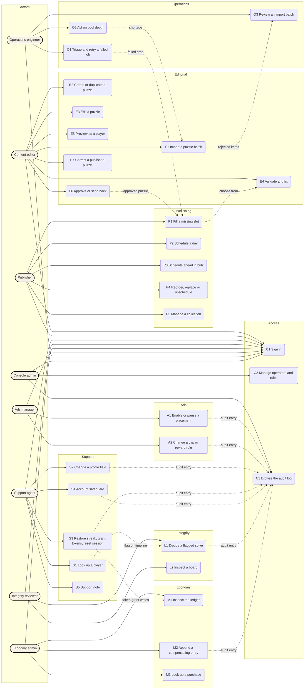

# Crosscut admin console — actors, use cases and happy paths

**TL;DR:** Eight operator roles and 26 use cases cover everything the console must let an admin do; each has one happy path and a named screen list.
**Confidence:** High for editorial, publishing, support and operations (grounded in `docs/ARCHITECTURE.md`, the glossary and the research brief); medium for economy, ads and access, whose backend commands do not exist yet.
**Peter decides:** confirm or trim the role and use-case list, and pick the build vehicle in the last section, before the clickable prototype is built.

## Actors

The backend design names only "editors" and a shared admin token. The console needs finer roles because the safeguards differ by domain. One person may hold several roles; the console shows only the navigation a role permits.

| Actor | Owns | Never does |
|---|---|---|
| Content editor | Puzzle library, puzzle editor, validation, preview, approval | Scheduling, player data |
| Publisher | Drop desk, daily slots, publish time, schedule-ahead, collections | Editing puzzle content |
| Support agent | Player lookup, profile fields, streak/session/token support actions, account safeguards, notes | Leaderboard or ledger decisions |
| Integrity reviewer | Flagged solves, board eligibility decisions, shadow status | Reward decisions (stay with economy) |
| Economy admin | Ledger inspection, compensating entries, purchase lookup | Editing balances directly |
| Ads manager | Placement enablement, caps, rewards, first-session grace, fill and grant health | Campaigns, targeting, revenue reporting (AdMob) |
| Operations engineer | Job signals, retries, pool depth, import batch outcomes | Content or player mutations |
| Console admin | Operator accounts, roles, environment, audit log | Domain work |

## Use-case diagram

Dotted arrows are hand-offs between use cases. Every mutation ends in an audit entry that Console admin can browse (C3).

## Happy paths

Each path is the single unbroken route from intent to confirmed result. Error branches are out of scope for the clickable prototype except where a validation failure is the normal first state (E4, P1). Screens are named as they should appear in navigation. "Reason" always means a required free-text field; "Review" always means a before/after panel with a confirm control.

### Editorial (Content editor)

| ID | Happy path | Screens and dialogs |
|---|---|---|
| E1 Import a puzzle batch | Library → Import → drop or pick JSON files → validation summary (accepted / rejected counts) → per-item results → Import → batch appears in Library as Draft and in Operations as an import batch | Library, Import dialog (3 steps), Operations |
| E2 Create or duplicate a puzzle | Library → New puzzle (kind, language, difficulty) or row menu → Duplicate as draft → Editor opens on the new Draft | Library, New-puzzle dialog, Editor |
| E3 Edit a puzzle | Editor → Metadata tab (title, language, difficulty, topics, author) → Content tab (crossword: grid, clues, answers; Daily Five: five answers, hint, dictionary check) → Save → version incremented | Editor (Metadata, Content) |
| E4 Validate and fix | Editor → Run validation → Validation panel lists failures with the exact cell or clue → click a failure to focus it in Content → fix → re-run → Passed | Editor (Validation panel) |
| E5 Preview as a player | Editor → Preview → phone-frame rendering of the feed card and the solve screen → close | Editor (Preview drawer) |
| E6 Approve or send back | Editor (status Needs review, validation Passed) → Approve → reason optional, or Send back → reason required → status updates; the puzzle becomes available to P1 | Editor (Review bar), Library |
| E7 Correct a published puzzle | Library → Published row → Create correction → Editor on a new version → validate → Approve → Publish correction → players who already solved keep their result, new players get the corrected version | Library, Editor, Publish-correction review |

### Publishing (Publisher)

| ID | Happy path | Screens and dialogs |
|---|---|---|
| P1 Fill a missing slot | Drop desk → blocked day → Choose puzzle → picker filtered to Approved of that kind and language → pick → day becomes Ready | Drop desk, Day inspector, Puzzle picker |
| P2 Schedule a day | Day inspector (Ready) → publish time (UTC or player-local, representative local times shown) → Confirm schedule → Review (items, time, consequence) → Confirm → status Scheduled, audit entry | Day inspector, Publish-time panel, Schedule review |
| P3 Schedule ahead in bulk | Drop desk → List → tick ready dates or Select all ready → Schedule N drops → Review shows count and effective time → Confirm → per-date results (queued / skipped with reason) | Drop desk list, Bulk review, Bulk results |
| P4 Reorder, replace or unschedule | Day inspector (Scheduled, not yet live) → drag or move puzzle order → Replace → picker → or Unschedule → reason → day returns to Ready | Day inspector, Puzzle picker, Reason dialog |
| P5 Manage a collection | Collections → pick a collection → membership list (add from library, reorder, remove) → metadata (shelf, emoji, blurb, unlock rule, reward) → visibility → Preview shelf → Save | Collections list, Collection editor, Preview |

### Support (Support agent)

| ID | Happy path | Screens and dialogs |
|---|---|---|
| S1 Look up a player | Players → search by ID, name or sign-in → result list → open → Profile, Timeline, Devices & ads, Notes tabs | Players search, Player record |
| S2 Change a profile field | Player record → Profile → Edit a field → change → Save → Reason → Review (old, new, notification to player) → Confirm → audit entry, field marked Changed | Player record, Reason and review dialog |
| S3 Restore streak, grant tokens, reset session | Player record → Support actions → choose action → parameters (days, amount, or none) → Reason → Review (before/after, ledger effect) → Confirm → timeline and audit updated | Player record, Action panel, Review dialog |
| S4 Account safeguard | Player record → Account → Force sign-out, Suspend, Merge duplicate (pick the other account), or Delete on request → Reason → two-step confirm for destructive ones → result state | Player record, Safeguard dialogs |
| S5 Support note | Player record → Notes → Add note → text and status Open / Closed → Save; Close an open note | Player record (Notes) |

### Integrity (Integrity reviewer)

| ID | Happy path | Screens and dialogs |
|---|---|---|
| L1 Decide a flagged solve | Leaderboards → flagged row → Evidence (solve time vs cohort, S1–S4 flags, device change, prior decisions) → decision: Clear, Exclude from board, or Shadow → Reason → Confirm → row shows decision, board eligibility updated, audit entry | Leaderboards queue, Flag detail, Decision dialog |
| L2 Inspect a board | Leaderboards → Boards tab → scope (week or puzzle, language) → ranked list with eligibility markers → open a player → jumps to S1 | Leaderboards boards, Player record |

### Economy (Economy admin)

| ID | Happy path | Screens and dialogs |
|---|---|---|
| M1 Inspect the ledger | Economy → filter by player, entry type, date → entry detail (reason, operator or system, idempotency key, balance after) | Economy ledger, Entry detail |
| M2 Append a compensating entry | Economy → player → Add compensating entry → amount and currency (tokens or stars) → Reason → Review (current balance, entry, balance after) → Confirm → new entry appended, audit entry. Disabled with an explanation until the audited server command exists | Economy ledger, Compensation dialog |
| M3 Look up a purchase | Economy → Purchases tab → search by player or receipt → purchase detail (pack, plan, idempotency key, status) | Economy purchases, Purchase detail |

### Ads (Ads manager)

| ID | Happy path | Screens and dialogs |
|---|---|---|
| A1 Enable or pause a placement | Ads → placement toggle → effective time (now or scheduled) → Reason → Confirm → row updates, audit entry | Ads placements, Effective-time dialog |
| A2 Change a cap or reward rule | Ads → placement → Edit rule (cap per day, reward, first-session grace) → Review (old, new, affected platforms) → Confirm → audit entry | Ads placements, Rule editor, Review dialog |

### Operations (Operations engineer)

| ID | Happy path | Screens and dialogs |
|---|---|---|
| O1 Triage and retry a failed job | Operations → failed signal → detail (job, affected object, error, last runs) → Retry → per-item outcome → signal clears or names the remaining item | Operations signals, Signal detail, Retry results |
| O2 Act on pool depth | Operations → pool-depth row → per-language and per-kind depth against the floor → Open library filtered to Approved of the short kind → hand to E1 or P1 | Operations, Library (filtered) |
| O3 Review an import batch | Operations → import batch → accepted and rejected items with reasons → open a rejected item in Editor | Operations, Batch detail, Editor |

### Access (Console admin and everyone)

| ID | Happy path | Screens and dialogs |
|---|---|---|
| C1 Sign in | Sign-in → operator identity → console opens with the operator name, roles and environment label (Demo, Staging, Production) in the shell | Sign-in, Shell |
| C2 Manage operators and roles | Access → operators list → invite or edit → assign roles → Save → audit entry | Access, Operator dialog |
| C3 Browse the audit log | Access → Audit → filter by operator, object, action, date → entry detail → Open affected object | Audit log, Entry detail |

## What the current prototype already covers

`CrosscutAdminConsole.html` implements the shell and the read states for most areas. The table shows which happy paths are clickable end to end today.

| Area | Clickable now | Missing for the happy path |
|---|---|---|
| Drop desk | Calendar and list, day selection, add approved puzzle to a slot, publish-time modes, schedule-ahead selection | Puzzle picker (P1), schedule review and result (P2, P3), reorder, replace, unschedule (P4) |
| Puzzle library | Filters, density, row selection, import entry point | Import steps (E1), new puzzle (E2), Editor and all its tabs (E3–E7) |
| Collections | Nothing | Whole area (P5) |
| Players | Fixed three-player list, tabs, edit state, action selection, reason placeholder | Search (S1), reason and review dialogs (S2, S3), safeguard flows (S4), note creation (S5) |
| Leaderboards | Queue table | Flag detail and decision (L1), boards view (L2) |
| Economy | Ledger table | Filters and entry detail (M1), compensation flow (M2), purchases (M3) |
| Ads | Placement toggles and rule cards | Effective time and reason (A1), rule editor and review (A2) |
| Operations | Signals table | Signal detail and retry results (O1), pool-depth drill-down (O2), batch detail (O3) |
| Access | Operator card in the sidebar | Sign-in (C1), operators and roles (C2), audit log (C3) |

## Build plan for the clickable prototype

Screens to add or complete, grouped so each group can be built and reviewed independently:

1. Shell and access: sign-in, role-aware navigation, environment label, audit log with entry detail, operators and roles.
2. Editorial: import dialog, new-puzzle dialog, Editor with Metadata, Content, Validation, Preview and Review bar, correction flow.
3. Publishing: puzzle picker, schedule review and results, bulk results, day reorder and unschedule, Collections list and editor.
4. Support: player search, reason and review dialog pattern, action parameters, safeguard dialogs, note creation.
5. Integrity and economy: flag detail and decision, boards view, ledger filters and entry detail, compensation dialog, purchases.
6. Ads and operations: effective-time dialog, rule editor, signal detail, retry results, pool-depth drill-down, batch detail.

Shared patterns to build once and reuse everywhere: reason field, before/after review panel, per-item results list, audit entry line, status pill, and the puzzle picker.

**Build vehicle, Peter's call.** The current prototype is a single Claude Design artboard whose one component renders every screen from string templates. Adding 26 flows and about 20 dialogs to that one component will make it slow to edit and hard for several agents to work on in parallel. The recommended vehicle is a plain multi-screen HTML prototype in `admin-console/` with a hash router, one file per area, shared CSS built from the guidelines, and demo data in one module. The artboard stays as the visual reference for the shell and drop desk. The alternative is to keep extending the artboard, which preserves in-canvas editing but limits parallel work.
